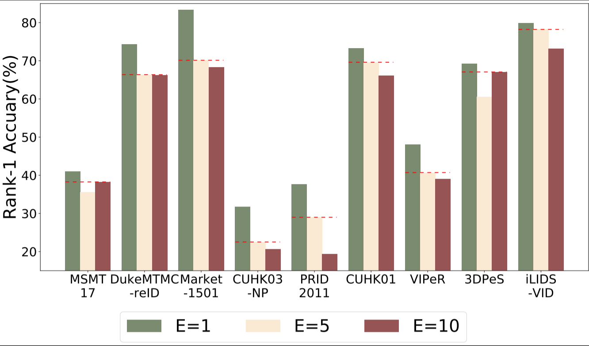

# Experiments

## Plot Result Curves/Bar Plots

These scripts read your training log file:

* Plot Rank-1/mAP versus Epochs on some Collection of Datasets: 
    ```
    python plot_Rank1_mAP_curve.py --log_file_path --save_fig_path
    ```

* Bar-Plot Rank-1/mAP of Best Fed-Model on All Datasets ("Best" is defined as the Average Performance of Top-3 Fed-Models on Big-Datasets): 
    ```
    python plot_Rank1_mAP_bar.py --log_file_path --save_fig_path
    ```

* Bar-Plot Comparsion of Rank-1 Accuracy with Different Local-Epochs(i.e. E=1,E=5,E=10)  
You need to Provide all Log Files!  
One can Use this script to Do Comparison with Different Batch Sizes as well. 
    ```
    python plot_Rank1_versus_local_epoch.py --log_file1_path --log_file2_path --log_file3_path --save_fig_path
    ```
**Bar Plots of Best Fed-Models within 300 rounds:**




 python ./experiments/plot_da_revise.py --final_file_name './logs_cdw/market_cdw_0.05prox_0.05simi_0.5tir_0.5id/ft_ResNet50/train_log.txt' --raw_file_name './logs_DA/market_debug_nocdw_0.5tri_0.5crosentropy/ft_ResNet50/train_log.txt' --simi_file_name './logs_DA/market_0.5tri_0.5crossentropy_0.1prox/ft_ResNet50/train_log.txt' --no_cdw_file_name './logs_cdw/market_cdw_0.05prox_0.05simi_0.5tir_0.5id/ft_ResNet50/vs_no_cdw_0.05prox_0.05simi_0.5tri_0.5id.txt' --logit_cdw_file_name './logs_debug/market_raw_cdw_debug/ft_ResNet50/train_log.txt' --fig_name './logs_cdw/market_cdw_0.05prox_0.05simi_0.5tir_0.5id/ft_ResNet50/all_compare_revise/'


# msmt_cdw
 python ./experiments/plot_da_revise.py --final_file_name './logs_cdw/msmt_cdw_0.05prox_0.05simi_0.5tir_0.5id/ft_ResNet50/train_log.txt' --raw_file_name './logs_cdw/msmt_cdw_0.05prox_0.05simi_0.5tir_0.5id/ft_ResNet50/vs_raw.txt' --simi_file_name './logs_cdw/msmt_cdw_0.05prox_0.05simi_0.5tir_0.5id/ft_ResNet50/vs_0.1prox.txt' --no_cdw_file_name './logs_cdw/msmt_cdw_0.05prox_0.05simi_0.5tir_0.5id/ft_ResNet50/vs_no_cdw_0.05prox_0.05simi_0.5tri_0.5id.txt' --logit_cdw_file_name './logs_cdw/msmt_cdw_0.05prox_0.05simi_0.5tir_0.5id/ft_ResNet50/vs_raw_cdw_0.05prox_0.05simi_0.5tri_0.5id.txt' --fig_name './logs_cdw/msmt_cdw_0.05prox_0.05simi_0.5tir_0.5id/ft_ResNet50/all_compare_revise_10-28/'